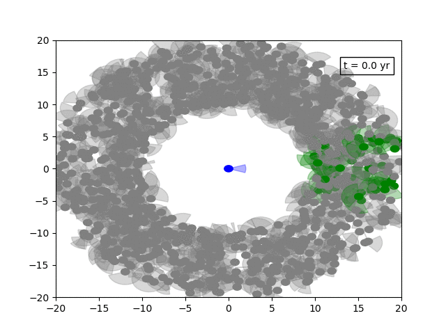

taktent: a simulator package for (radio) SETI
==============================================

This Python package allows the user to setup and run an agent-based simulation of a SETI survey.  The package allows the creation of a population of observing and transmitting civilisations.  Each transmitter and observer conducts their activities according to an input strategy.  The success of observers and transmitters can then be recorded, and multiple simulations can be run for Monte Carlo Realisation.

This package is therefore a flexible framework in which to simulate and test different SETI strategies, both as an Observer and as a Transmitter.

Features
--------

* Object-oriented, agent-driven simulation of Observers and Transmitters

* Simulates continuous and pulsing broadcasts at a defined beam-size

* Permits transmission/observation as a scan across the sky, or as a series of discrete pointings

* Accounts for Doppler drift due to transmitters/observers orbiting a host star

* Generates maps of the sky as seen from Observers' point of view

Future Features/Wishlist
------------------------

* Currently designed for electromagnetic communications - in principle extendable to e.g. neutrino or gravitational wave emission

* Interstellar scintillation/absorption/dispersion

Installation Instructions
--------------------------

This package is yet to be hosted on PyPI...

Examples of Use
---------------

Examples of how to use tak-tent to setup and conduct SETI simulations can be found in the `src/examples/` folder.

Package Structure
------------------

The package contains several modules defining six fundamental classes: 

### `agents/`

`Vector3D` - a 3D cartesian vector class

`Agent` - a generic agent base class

        `Transmitter(Agent)` - a transmitting civilisation

        `Observer(Agent)` - an observing civilisation
 
### `strategies/`

`Strategy` - a base class that defines generic targeting behaviour of an agent as a function of time

               `PointingStrategy(Strategy)` - A discrete pointing strategy (defined by a list of target vectors)
               `scanningStrategy(Strategy)` - A continuous pointing strategy (defined by a target vector function)

### `population/`

`Population` - a class that defines the combined population of Transmitters and Observers, and drives the simulation

Code dependencies
-----------------

The code has been developed in Python 3.6, using numpy 1.14.3 and matplotlib 2.2.2

The Name
---------

The name "taktent" is derived from the Scots phrase "tak tent o' the sma things", which translates as "pay attention to the little things"

 

